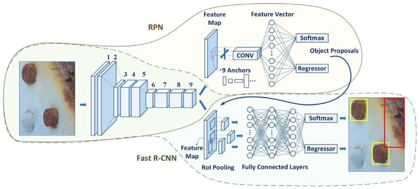
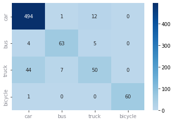
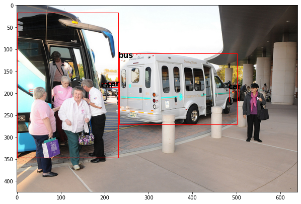
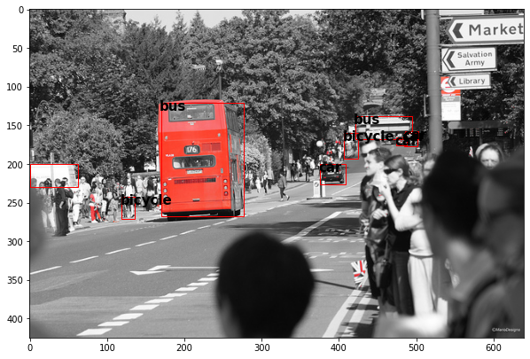
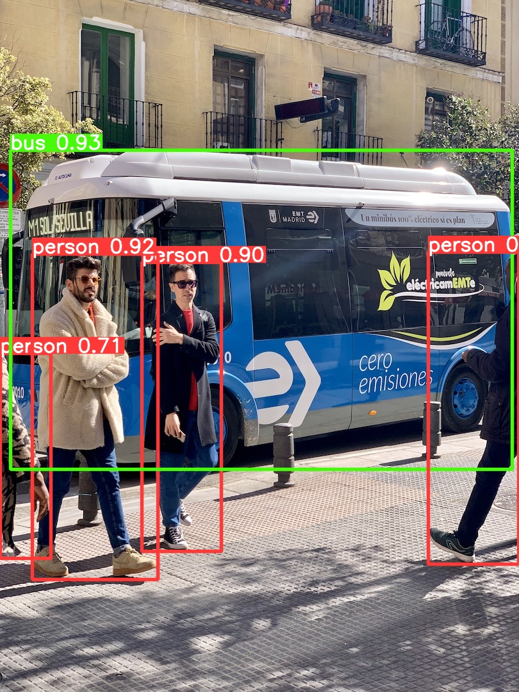

# Object Detection on COCO Dataset

Ashwani Rajan, Chahak Sethi

## Goal
The goal of this project is to perform object detection on Common Objects in Context (COCO) Dataset. We aim to get hands-on experience working with the state-of-the-art object detection models by using the pretrained models for inference and by fine-tuning the model for a custom dataset of our interest. We aim to explore two architectures: Yolo-v5 and Faster-RCNN models. Finally, we aim to compare the model performance and training speed of these architectures on the Coco Dataset.

## About the Dataset
[Common Objects in Context (COCO)](https://cocodataset.org/#home) is a large-scale open source dataset for a number of computer vision tasks. It is the benchmark dataset for object detection tasks. It contains arround 118,000 training images and 5000 validation images, along with 80 object categories. For this project, we use a subset of the COCO dataset to perform training and inference for the two models that we use. For Yolov5, we use all the object categories. However, for Faster-RCNN, due to high training time, we have taken only four land-vehicle classes: "car", "bus", "truck" and "bicycle".

## Models and Inference


For this project, we use the two state-of-the-art models for object detection, Yolo-v5 and Faster-RCNN. We started with the [**Faster RCNN model**](https://arxiv.org/abs/1506.01497) for object detection. We used the Faster RCNN model from torchvision with **ResNet-50-FPN backbone** with pretrained weights trained on Imagenet. We directly used the **train_one_epoch** and **evaluate** functions from torchvision's [github repository](https://github.com/pytorch/vision.git) to fine tune the model. 

<p align="center">

</p>

[**Yolo-v5**](https://docs.ultralytics.com/) is a family of compound-scaled object detection models trained on COCO dataset. YOLO an acronym for "You only look once' is an algorithm that divides images into a grid system. We checked the performance of pretrained YOLO on the COCO validation dataset and further trained 3 epochs on the architecture taking the weights from YOLO.

## Results

**Faster RCNN model** : Using the pre-trained ResNet-50-FPN network and training for 5 epochs with a constant learning rate of 0.005, we see a constant decline in the loss values. The Average Precision at IOU 50:95 is observed around 0.32 after 5 epochs. We further evaluated the model's performance through f1-score, precision and recall and the confusion matrix and we found these observations:

<p align = "center">

| metrics | Confusion Matrix |
| ------- | ---------------- | 
|  |  |

</p>

Here are some examples of the results:
|  |  |
|----- | ----- |
| | |

**Yolo model** :  The pre-trained model has the Average Precision IOU 50:95 raised to 0.493.

The pre-trained model was further trained for 3 epochs with a constant learning rate of 0.01. With these epochs we see a very minor improvement in the Average Precision IOU 50:95 raised to 0.506.

Here is an example of the result:
<p align = "center">

|  |  |
|----- | ----- |
| 

</p>
## Installations

To use the notebook, you would need to install fiftyone library and latest version of torchvision. Yoo would also need to clone the pytroch's vision repository and copy the required files (engine.py, transforms.py, utils.py) from references folder to your working directory. Once all the dependencies are installed, you should be able to replicate the results using the **Faster-RCNN-COCO.ipynb** notebook. 

```console 
!pip install fiftyone
!pip install torch torchvision
!pip install opencv-python-headless==4.5.4.60 # needed only if there's an open-cv related error 

git clone https://github.com/pytorch/vision.git
```

To use yolov5, you would need to clone the ultralytics's repository for yolo5 to your working directory and install the requirements in the requirement.txt.

```
!git clone https://github.com/ultralytics/yolov5 
!cd yolov5
!pip install -qr requirements.txt
```
