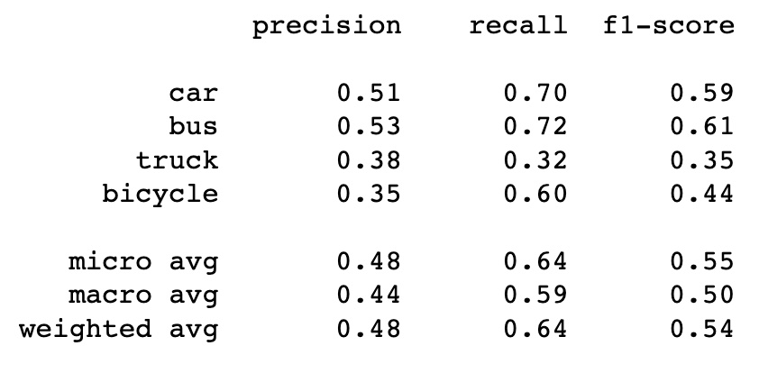

# Object-Detection
Object Detection on COCO Dataset

## Goal
The goal of this project is to perform object detection on Common Objects in Context (COCO) Dataset. We aim to get handa-on experience working with the state-of-the-art object detection models by using the pretrained models for inference and by fine-tuning the model for a custom dataset of our interest. We aim to explore two architectures: Yolo-v5 and Faster-RCNN models. Finally, we aim to compare the model performance and training speed of these architectures on the Coco Dataset.

## About the Dataset
[Common Objects in Context (COCO)](https://cocodataset.org/#home) is a large-scale open source dataset for a number of computer vision tasks. It is the benchmark dataset for object detection tasks. It contains arround 118,000 training images and 5000 validation images, along with 80 object categories. For this project, we use a subset of the COCO dataset to perform training and inference for the two models that we use. For Yolov5, we use all the object categories. However, for Faster-RCNN, due to high training time, we have taken only four land-vehicle classes: "car", "bus", "truck" and "bicycle".

## Model and Inference

For this project, we use the two state-of-the-art models for object detection, Yolo-v5 and Faster-RCNN. We started with the [**Faster RCNN model**](https://arxiv.org/abs/1506.01497) for object detection. We used the Faster RCNN model from torchvision with **ResNet-50-FPN backbone** with pretrained weights trained on Imagenet. We directly used the **train_one_epoch** and **evaluate** functions from torchvision's [github repository](https://github.com/pytorch/vision.git) to fine tune the model.

<Yolo>

## Results

**Faster RCNN model** : Using the pre-trained ResNet-50-FPN network and training for 5 epochs with a constant learning rate of 0.005, we see a constant decline in the loss values. The Average Precision at IOU 50:95 is observed around 0.32 after 5 epochs. We further evaluated the model's performance through f1-score, precision and recall and the confusion matrix and we found these observations:

| metrics | Confusion Matrix |
| ------- | ---------------- | 
|  |  |

Here are some examples of the results:
|  |  |
|----- | ----- |
| | |

<Yolo>

## Installations

